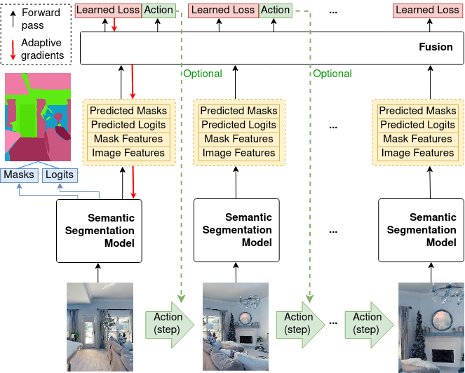

# Segmatron: Embodied Adaptive Semantic Segmentation


## Installation

The evaluation of SegmATRon can be performed inside a docker container. One can find all necessary files and scripts to build a docker image and run a docker container inside "docker/" folder. Read the README.md inside the "docker/" directory. Prepare data and checkpoints before building the docker image.

Alternatively, you can create a conda environment with Python 3.8, CUDA 11.3 and PyTorch 1.11.0. Then:

Install OpenCV:
```
pip3 install -U opencv-python
```
Install detectron2:
```
python -m pip install 'git+https://github.com/facebookresearch/detectron2.git'
```

Install other requirements:

```
docker/requirements.txt ./
pip install -r docker/requirements.txt
```

Install ninja:
```
sudo wget -qO /usr/local/bin/ninja.gz https://github.com/ninja-build/ninja/releases/latest/download/ninja-linux.zip
sudo gunzip /usr/local/bin/ninja.gz
sudo chmod a+x /usr/local/bin/ninja
```

Setup CUDA Kernel for MSDeformAttn.
```
cd models/oneformer/modeling/pixel_decoder/ops
sh make.sh
cd ../../../../..
```
## Data and pretrained checkpoints

Test data and pretrained checkpoints can be downloaded by using the following links:

- [OneFormer (Single Frame Baseline)](https://disk.yandex.ru/d/p2GKLZ_Z49IWdA)
- [SegmATRon (1 step)](https://disk.yandex.ru/d/DwRCff70Ij3ang)
- [SegmATRon Habitat and AI2-Thor data](https://disk.yandex.ru/d/6Ek7u6LXDccrSA)

Expected data and pretrained checkpoints structure:
    segmatron/
        checkpoints/
            single_frame_baseline.pt
            segmatron_1_step.pt
        data/
            segmatron_ai2thor/
                annotations/
                test/
                test_mask/
            segmatron_habiti/
                annotations/
                val/
                val_mask/

## Evaluation

Evaluation of the SegmATRon (1 step) model and OneFormer (Single Frame baseline) can be performed by running 

OneFormer Single Frame baseline on AI2-THOR dataset:

``python evaluate.py --config=configs/oneformer_single_frame_baseline_ai2thor.yaml``.

OneFormer Single Frame baseline on Habitat dataset:

``python evaluate.py --config=configs/oneformer_single_frame_baseline_habitat.yaml``.

SegmATRon (1 step) on AI2-THOR dataset:

``python evaluate.py --config=configs/config_segmatron_1_step_ai2thor.yaml``.

SegmATRon (1 step) on Habitat dataset:

``python evaluate.py --config=configs/config_segmatron_1_step_habitat.yaml``.

The code will automatically take over current GPU device.

The evaluator will output visualizations and results in a folder called
`evaluation_results/`. 

Note: the evaluation results can be slightly different depending on the specific random actions chosen by SegmATRon (1 step). For demo purposes we set random seed equal to 0.


## Acknowledgements

We thank the authors of OneFormer (https://github.com/SHI-Labs/OneFormer), Interactron (https://github.com/allenai/interactron), and DETR (https://github.com/facebookresearch/detr) for releasing their helpful codebases.
